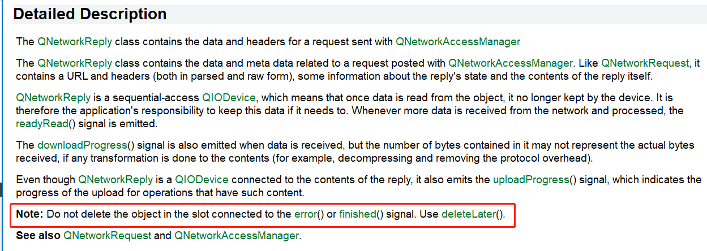
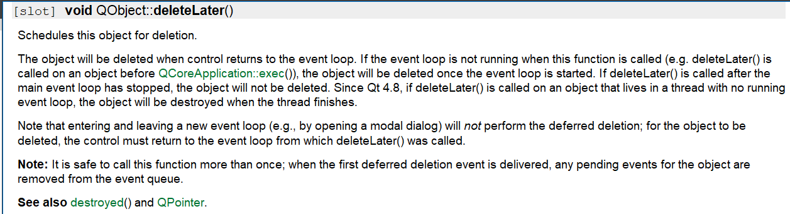

# 在Qt中，如何使用Qt自带的HTTP接口

## 目前只用到了常用的两种请求方法

>## 1.GET请求(一般用于获取资源)
>## 2.POST请求(一般用于传输资源)

## 简单介绍一下HTTP：

>###  HTTP由三部分组成:  请求行， 请求头， 请求体

---


## A.请求行(一般由三部分组成)：

>## 请求方法 Request Method
>## 请求路径 Request URL
>## 请求版本 Request Version

---------------------------------------------------


## B.请求头

### 请求头是以键值对的形式出现在HTTP协议中,常见的请求头如下：
>### Content-Type: 数据类型(text/html等)
>### Content-Length: Body的长度
>### Host: 客户端告知服务器, 所请求的资源是在哪个主机的哪个端口上;

## tips: 空行代表请求头的结束, 空行也可以用\r\n书写

------------------------------------------------------------------------------------------------


## C.请求体

>### GET方法没有请求体，因为GET方法的请求参数都已经跟在了URL（地址栏）的后面。

--------------------

# 以体测中发送心跳的接口为例抓包查看HTTP格式:

>


---


## 请求行和请求头:

>

-----


## 请求体:

>


-------------------------------


# 在Qt中使用HTTP:

### 在Qt中，QNetworkAccessManager类提供了所有的网络的请求和回复

>
>
>Qt说一个程序里面一个QNetworkAccessManager的对象就够了？ 那怎么满足各种请求并发的情况，还有怎么将每一条回复与发出去的请求相对应起来？
>
>由于暂时没有解决这个问题，所以我采用一种请求对应一个QNetworkAccessManager对象的方法

-----------------------

## 1.GET请求:

>通过查看Qt的文档发现，要发送get请求，需要构造传入一个QNetworkRequest实例
>
>
>```c++
>//1.创建一个QNetworkRequest对象，QNetworkAccessManager对象， QNetworkReply对象
>QNetworkAccessManager  *netWorkMgr = new QNetworkAccessManager();
>QNetworkRequest	        request;
>
>//一般不用去new 这个类的对象，只是用来控制和接收QNetworkAccessManager对象的请求
>QNetworkReply          *reply = nullptr;
>
>//2.绑定信号槽
>connect( netWorkMgr, &QNetworkAccessManager::finished, [=]( QNetworkReply *pReply ){
>       //有返回就先关闭定时器
>       timeoutTimer.stop();
>
>       //判断是否请求成功
>       if( QNetworkReply::NoError != pReplay->error() ){
>             //如果请求失败,可以查看错误信息
>             qDebug() << "error string = " << pReply->errorString();
>
>             //!!!!销毁接收对象,使用deleteLater删除，并且手动置空(惨痛的教训)否则容易引起崩溃
>             pReply->deleteLater();
>             pReply = nullptr;
>             reply = nullptr;
>             return;
>       }
>
>       //如果请求成功,则可以着手处理返回来的Json信息
>       QByteArray recvData = pReplay()->readAll();
>       bool ok = parse( recvData );
>
>       //销毁接收对象
>       pReply->deleteLater();
>       pReply = nullptr;
>       reply = nullptr;
>});
>
>    //3.设置url
>    request->set( QUrl( "http://dev.cdwalker.com/api/base/user/sync?updateTime=0&faceEngineType=2" ) );
>
>    //4.发送请求
>    reply = netWorkMgr->get( request );
>
>    //5.开启超时等待( Qt5.12.4没有提供设置超时等待时长的接口, 在Qt5.15.2中就可以设置 )
>    QTimer *timeoutTimer = new QTimer();
>    timeoutTimer->start( 3000 );
>
>    //绑定超时
>    connect( timeoutTimer, &QTiemr::timeout, [=](){
>       //丢弃这次请求, 执行这条语句后，会立马触发QNetworkAccessManager::finished信号，从而执行相应的槽函数
>       reply->abort();
>       timeoutTimer->deleteLater();
>});
>```
## 关于deleteLater :

>


>

--------------------


## 2.POST请求

### 首先看文档：

>

----


## 一般常用的是后两个函数

>```c++
>//常用于发送文本信息
>QNetworkReply *post(const QNetworkRequest &request, const QByteArray &data)
>    
>//常用于发送带文件的信息
>QNetworkReply *post(const QNetworkRequest &request, QHttpMultiPart *multiPart) 
>```

---


## A.发送文本信息

### 以体测中发送心跳为例:

>```C++
>//1.和GET方法一样，同样需要传入一个QNetworkRequest 对象，但是在构造QNetworkRequest 对象时，需要设置额外的参数( header )
>QNetworkAccessManager  *netWorkMgr = new QNetworkAccessManager();
>QNetworkRequest	        request;
>QNetworkReply          *reply = nullptr;
>
>//2.设置相关URL和请求头参数
>request.setUrl( QUrl( "http://dev.cdwalker.com/api/standard/device/heart" ) );
>
>//需要设置响应的请求头参数,否则会导致使用默认的 application/x-www-form-urlencoded 类型，导致服务器无法正确解析参数
>request.setHeader( QNetworkRequest::ContentTypeHeader, "application/json" );
>
>//3.如果是纯文本消息，根据实际情况构造一个QByteArray
>QByteArray heartBeatInfo = getHeartBeatInfo();
>netWorkMgr->post( request, heartBeatInfo );
>
>//4.接收和处理响应部分参考GET请求部分
>...
>...
>...
>```

--------------


## B.发送带文件的请求 ( form-data 表单类型 )

### 以体测中，上传成绩为例 :

>```c++
>//1.发送表单数据需要传入一个 QHttpMultiPart 对象指针
>QNetworkAccessManager  *netWorkMgr = new QNetworkAccessManager();
>QNetworkRequest	        request;
>QHttpMultiPart         *multiPart  = new QHttpMultiPart( QHttpMultiPart::FormDataType );
>```
------


### 主要用到这两个接口 :

>
>
>#### setBody  用于添加文本信息
>#### setBodyDevice  用于添加文件信息

---


### 添加文本信息 :

>```c++
>QHttpPart textPart;
>QString headerName = "form-data; name = userId";
>QString userId     = "342";
>
>//为每一个QHttpPar设置头部信息和
>textPart.setHeader( QNetWorkRequest::ContentDispositionHeader, headerName.toLocal8Bit() );
>textPart.setBody( userId.toLocal8Bit() );
>
>//将 textPart添加进 multiPart 中
>multiPart->append( textPart );
>```


### 添加文件信息 :

>```c++
>//添加文件信息需要将文件读到一个QFile对象中去
>QHttpPart filePart;
>QString   fileName = "./1.png";
>
>//与服务器端约定的键值
>QString   key = "files";
>
>//这个内容应该是固定格式, 具体参考: https://blog.csdn.net/qianxing111/article/details/105052852/
>QString   headerName = "form-data; name = %1; filename = %2";
>
>//填充请求头字段
>headerName = headerName.arg( key, fileName );
>
>//打开文件
>QFile	 *file = new QFile( file, this );
>if( !file.open( QIODevice::readOnly ) ){
>        //如果打开失败， 需要根据实际情况灵活处理( 直接退出函数或者其他操作... )
>        qDebug() << "open file faild, error string = " << file->errorString();
>        ...
>        ...
>}
>
>//如果打开成功,则添加进 filepart 中
>filePart.setHeader( QNetworkRequest::ContentDispostionHeader, headerName.toLocal8Bit() ) ;
>
>// ！！！ 这里只能传对象指针，传对象进去会导致崩溃，原因尚未查明
>filePart.setBodyDevice( file );
>
>//将 filePart 追加到 multiPart
>multiPart->appendPart( filePart );
>
>//给file指针设置父对象，防止内存泄漏( Qt对象树机制 )
>file->setParent( multiPart );
>```


### 发送请求

>```c++
>//发送表单信息
>reply = netWorkMgr->post( request, multiPart );
>
>//给表单对象指针设置父对象，防止内存泄漏, 在响应槽函数中随着 reply 指针一起释放掉
>multiPart->setParent( reply );
>
>//处理接收部分同上述接收部分
>...
>...
>...
>```
----


## tips : 关于释放指针
>```c++
>1. multiPart 指针不能在收到返回之前释放，否则可能会导致程序崩溃
>2. 在函数中定义的 reply 指针和槽函数所接收到的 pReply 指针， 其实指向的是同一块内存, 只需调用一次 pReply->deletaLater()， 但是两个指针都需要手动置为nullptr，其中 multiPart 指针也需要跟着置为 nullptr
>```

----


## HTTP下载文件 :

> ### 首先注意使用到的三个关键信号 :
>
> 
>
> 
>
> 
>
> -----
>
> 
>
> ### 重点注意 downloadProgress 这个信号 :
>
> 
> -----
>
> ### 注意第一个参数 bytesReceived 代表的是已经累计下载的文件大小
>
> 
>
> ### 下载前的准备 : 
>
> ```c++
> //下载文件就是从服务器获取资源，所以顺理成章使用get方法
> 
> //下载文件时，通常并不会一次性下载完毕，所以需要一个持久的接收对象和文件写入对象,最好写成成员变量
> QNetworkReply *m_pReply = nullptr;
> QFile         *m_pFileWriter = nullptr;
> 
> 
> /*******************************************华丽的分割线*************************************************/
> 
> 
> //带中文的链接最好从QByteArray构造，不然容易乱码
> QByteArray urlData = "http://171.221.210.228:17777/prod-api/api/file/project/sport-mv/身高体重测试.mp4";
> 
> //构造两个请求对象
> QNetworkAccessManager *pNetWorkMgr = new QNetWorkAccessManager( this );
> QNetworkRequest        request;
> 
> //打开文件
> QString fileName = "./1.mp4";
> m_pFileWriter = new QFile( fileName, this );
> 
> //以只写并且清除的的方式打开文件
> if( !m_pFileWriter->open( QIODevice::WriteOnly | QIODevice::Truncate ) ){
>         //如果打开失败, 可以打印错误信息
>         qDebug() << "file open failed, ret = " << m_pFileWriter->errorString();
>         m_pFileWriter->deleteLater();
>         m_pFileWriter = nullptr;
>         return;
> }
> 
> //为请求对象设置链接
> request.setUrl( QUrl( QString::fromLocal8Bit( urlData ) ) );
> 
> //m_pReply 指针不能人为的去new, 只能由 pNetWorkMgr 调用 get 或者 post 函数后的返回值来进行赋值
> m_pReply = pNetWorkMgr->get( request );
> 
> //在发起请求后, m_pReply指针才会被赋值，在这个时候绑定信号槽才会生效
> connect( m_pReply, &QNetworkReply::downloadProgress, this, &CHttpRequest::onDownloadProgress );
> connect( m_pReply, &QNetworkReply::readyRead, this, &CHttpRequest::onDownloadReadyRead );
> connect( m_pReply, &QNetworkReply::finished, this, &CHttpRequest::onDownloadFinished );
> ```
>
> -----
>
> 
>
> ### 查看下载进度的槽函数 :
>
> ```c++
> void CHttpRequest::onDOwnloadProgress(qint64 recvBytes, qint64 totalBytes)
> {
>     //用于记录截止到上一次一共接收了多少个字节
>     static int tmpRecvedBytes = 0;
> 
>     //用于记录总共需要下载的字节数
>     static int tmpTotalBytes = totalBytes;
> 
>     //用于记录每一次实际接收到了多少个字节
>     static int singleDownload = 0;
> 
>     //计算每一次实际接收到了多少个字节
>     singleDownload = recvBytes - tmpRecvedBytes;
> 
>     //更新接收到的字节数
>     tmpRecvedBytes = recvBytes;
> 
>     //计算下载进度
>     double downloadProgress = 1.0 * recvBytes / totalBytes;
> 
>     //计算网速(粗略的计算，误差可能很大， 因为无法证明固定为一秒钟接收一次)
>     qDebug() << "downlaod speed = " << singleDownload / 1024 << "kb/s";
> }
> ```
>
> 
>
> ------
>
> 
>
> ### 写入文件的函数 : 
>
> ```c++
> void CHttpRequest::onDownloadReadyRead()
> {
>         //写入安全保护
>         if( nullptr == m_pFileWriter || !m_pFileWriter->isOpen() ){
>            //执行相应的操作, 可以在这里打开文件或者直接退出
>            ...
>            ...
>         }
> 
>         //循环写入文件
>         while( !m_pReply->atEnd() ){
>            //写入文件
>            m_pFileWriter->write( m_pReply->readAll() );
> 
>            //清空 m_pFileWriter 缓存区, 这是一个坑，如果不清空缓存区, 可能会存在写入不及时的情况
>            m_pFileWriter->flush();
>         }
> }
> ```
>
> ---------------------
>
> 
>
> ### 接收完成处理函数 :
>
> ```c++
> void CHttpRequest::onDownloadFinished()
> {
>         //安全保护
>         if( nullptr == m_pFileWriter || !m_pFileWriter->isOpen() ){
>            return;
>         }
> 
>         //删除接收对象
>         m_pReply->deletaLater();
>         m_pReply = nullptr;
> 
>         //关闭文件之前再次清空缓存区
>         m_pFileWriter->flush();
>         m_pFileWriter->close();
>         m_pFileWriter->deleteLater();
>         m_pFileWriter = nullptr;
> }
> ```
>
> 
>
> ----------------------
>
> ###  


### 参考连接:https://blog.csdn.net/qianxing111/article/details/105052852/